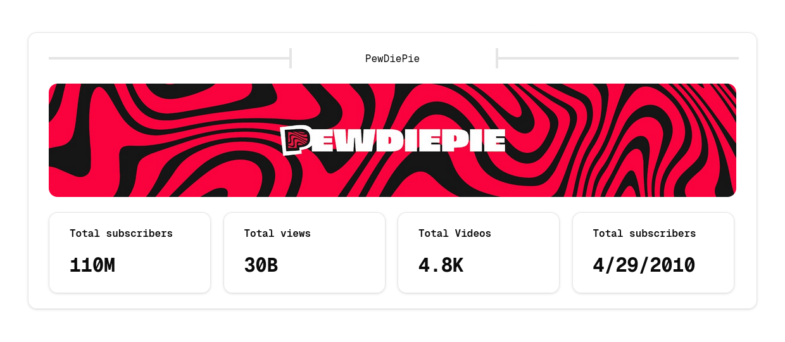

<h1 align="center">
    Youtube Analytics
</h1>

&nbsp;&nbsp;&nbsp;&nbsp;

<div align="center">
  <kbd align="center">
    
  </kbd>
  <picture>
    <source media="(min-width: 900px)" srcset="assets/empty.png">
    
  </picture>
  <kbd align="center">
    
  </kbd>
</div>

&nbsp;&nbsp;&nbsp;&nbsp;

<p align="center">
    A website designed to showcase statistics of a youtube channel by entering their youtube handle
</p>

## How to set up

### First intall all dependencies

```bash
npm install
```

### Create a .env file with a youtube api key

```
API_KEY=YOUR_YOUTUBE_API_KEY
```

### Run development server to test

```bash
npm run dev
```

## Deployment

The project was designed to be easily deployable on vercel. Make sure you set up the environment variable "API_KEY" before deployment.
